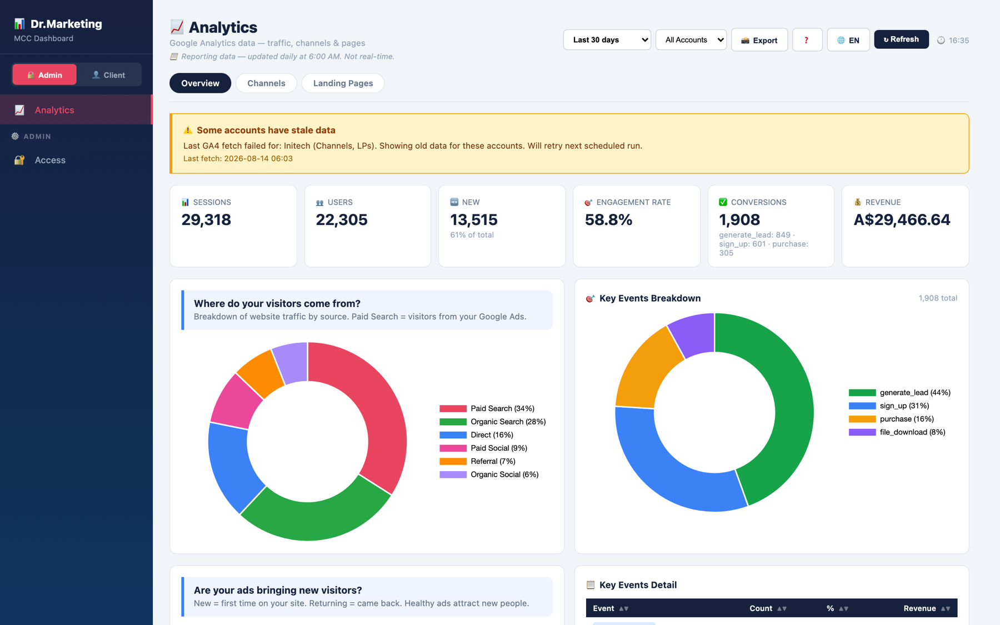
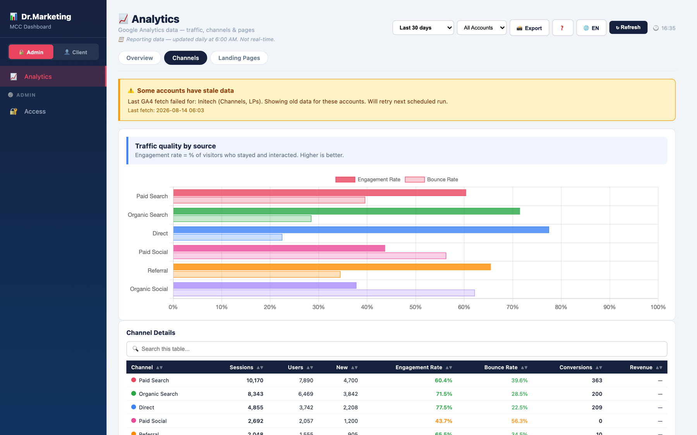
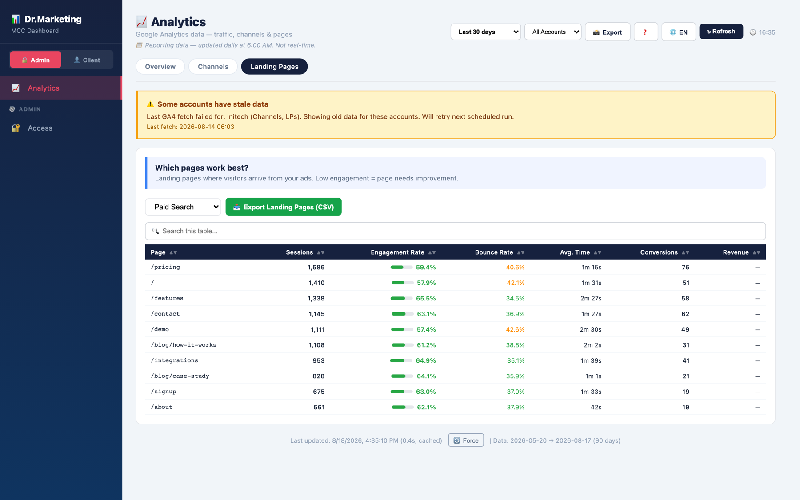
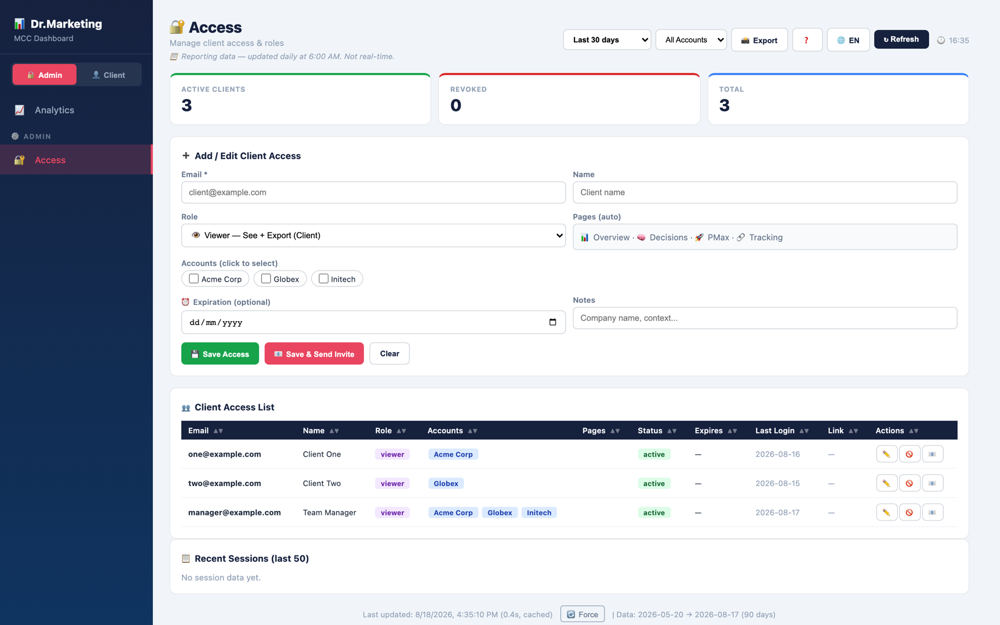
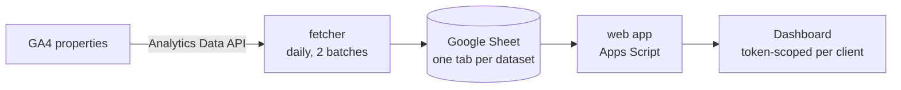

# GA4 Agency Dashboard

A multi-client GA4 dashboard that runs entirely inside Google Apps Script — no server, no
database, no hosting bill. Built to answer one question across a whole client roster:
**where is the measurement leaking?**

Most agency reporting tools show you what happened. This one starts from the assumption that
the numbers themselves are suspect: a release ships, a tag breaks, consent changes, and GA4
keeps reporting confidently on data it no longer collects. So collection failures are surfaced
in the interface rather than buried in a log, on every view, before anyone reads a trend line.

> Status: extracted from a production install running 16 GA4 properties daily. Published as a
> reference implementation — read it, fork it, take the parts you want.

## What it looks like

All figures below are invented — three fictional accounts, no client data.

**Overview** — the roster at a glance, key events broken out by type.



**Channels** — engagement and bounce per source, so a cheap channel that never engages
stops hiding inside a good-looking total. The amber banner is the point of the tool: one
account's last collection failed, and every view says so before you read a number.



**Landing pages** — arrivals by page for one channel at a time, exportable to CSV.



**Access** — one URL per client, scoped to their own property, revocable and expiring.



---

## What it does

Three views, all fed from the same daily snapshot, filterable to one client or the whole roster:

| View | Question it answers |
|---|---|
| **Overview** | Users, engagement and key events over 90 days — is anything drifting? |
| **Channels** | Where does traffic actually come from, and which sources engage? |
| **Landing pages** | Which pages take the arrival, and how do they hold attention? |

Sitting above all three is the part that matters most: **a staleness banner**. When a property
returns partial or failed data, the run is recorded and every view for that client carries a
warning naming exactly which datasets are stale and when the last good fetch was. A dashboard
that silently renders yesterday's numbers as today's is worse than no dashboard.

Access is per-client: each client gets a URL with their own token and sees only their own
property. Everything else in the roster stays invisible to them.

## Architecture



Three deliberate choices worth explaining, because they are the whole design:

**1. The spreadsheet is the database.** The collector writes, the dashboard reads, and the two
never talk to each other directly. If the GA4 API is down, rate-limits, or a property loses
access, the dashboard still renders yesterday's data instead of erroring. Failure is contained
to one side of the boundary.

**2. Collection is time-budgeted, not retry-driven.** Apps Script kills any execution at six
minutes. Rather than fight that with retries, the fetcher tracks its own runtime and stops
starting new properties when the budget runs out — the merge and write at the end always run,
and unfetched clients keep their previous data. Partial success beats a hard failure with an
empty sheet.

**3. Reads are cached in chunks.** A roster's worth of daily rows exceeds the 100KB cache
entry limit, so cached payloads are split across chunk keys and reassembled, with a tail-cap
on the largest append-ordered sheets. Bumping the cache key prefix invalidates every client at
once — the cheapest possible cache-busting mechanism.

None of this needs a server, which is the point. The whole thing costs zero to run.

## Install

There is no `npm install` here — Apps Script is a hosted runtime, so setup is a handful of
manual steps. Budget about 15 minutes.

1. **Create a blank Google Sheet.** Copy its ID from the URL. Every tab the dashboard needs is
   created on first run — there is nothing to import.
2. **Create an Apps Script project** (standalone) and note its script ID.
3. **Edit `config.js`** — paste the spreadsheet ID, your admin email, and one entry per GA4
   property you want to track. This is the only file you need to touch.
4. **Push the code**: copy `.clasp.json.example` to `.clasp.json`, fill in the script ID, then
   `clasp push` ([clasp](https://github.com/google/clasp) is Google's Apps Script CLI).
5. **Enable the Analytics Data API** in the editor: Services → Google Analytics Data → add.
   Apps Script handles the OAuth scope itself — there is no API key or OAuth client to set up.
6. **Deploy as a web app** (execute as: me / access: anyone with the link), then run
   `fetchGA4Batch1` once by hand to confirm data lands in the sheet.
7. **Set the daily triggers**: run `setupGA4Trigger()` once.

The web app URL is version-pinned: after any UI change, `clasp push` alone does not update
what the URL serves — you have to redeploy that deployment.

## Configuration

`config.js` is the entire configuration surface:

```js
var SPREADSHEET_ID = '...';           // the sheet this dashboard reads and writes
var ADMIN_EMAIL    = 'you@...';       // the account that gets full access
var GA4_PROPERTIES = [                // one entry per property on the dashboard
  { propertyId: '000000001', client_name: 'Acme Corp' }
];
```

Properties are collected in batches of eight to stay inside the execution limit. Adding a
ninth client to a batch is fine; adding a seventeenth means adding a third batch function and
its trigger.

## Files

| File | Role |
|---|---|
| `config.js` | Everything you edit |
| `ga4_fetcher.js` | Pulls GA4 → writes the sheet, on a daily trigger |
| `Code.js` | Web app server: auth, session, cached sheet reads |
| `index.html` | The dashboard UI (bilingual EN/FR) |
| `appsscript.json` | Manifest — declares the Analytics Data service |

## Limits, honestly

- **GA4 only.** An earlier version also reported on Google Ads; that scope was cut on purpose —
  two data sources in one dashboard made it a worse tool, not a richer one. The retired Ads
  views are still present in `index.html` as unreachable code: the navigation exposes four
  pages, the router still knows twenty. Deleting them is the obvious first contribution.
- **Roughly 16 properties** before the batching needs extending.
- **Access control is URL-token based**, which is appropriate for sharing a read-only view
  with a client and not appropriate for anything confidential.
- **Apps Script quotas apply** — this is designed for a boutique roster, not an enterprise one.

## License

MIT — see [LICENSE](LICENSE).

Built by [SolerAds](https://solerads.com).
